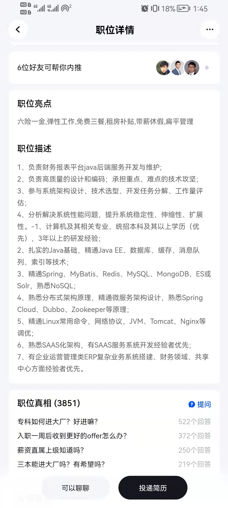

# dailyRoutine

## [Java & JavaEE](JAVA/readMe.md)

## [数据库](数据库/readMe.md)

## [缓存](缓存/readMe.md)

## 消息队列

## 索引

## Spring

## MyBatis

## Redis

## Mysql

## MongoDB

## ES

## NoSQL

## 分布式架构原理

## 微服务架构设计

## SpringCloud 

## Dubbo

## Zookeeper

## SAAS 架构

